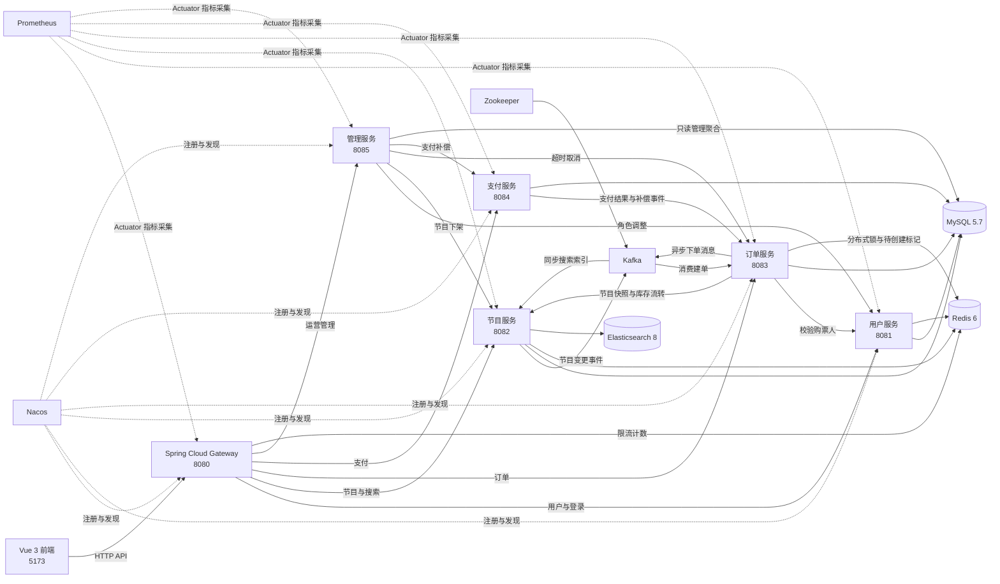
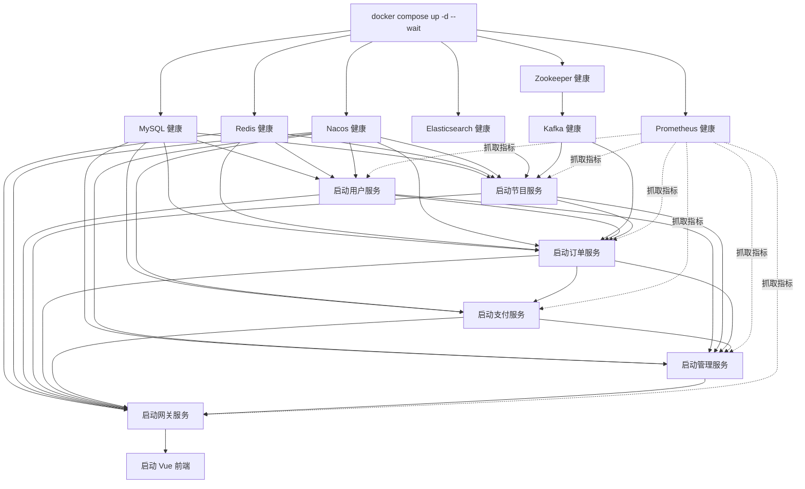
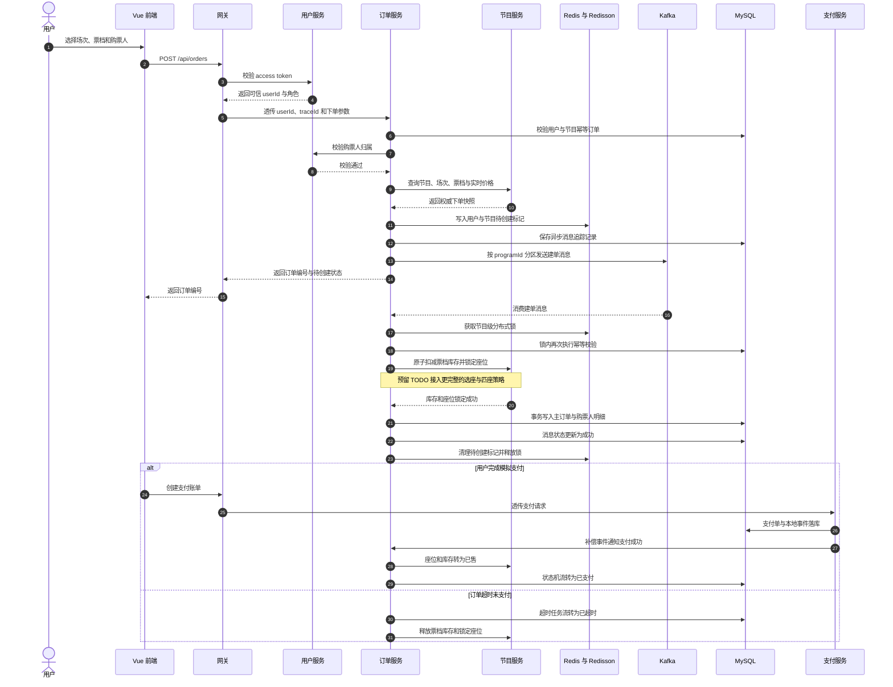

# 大麦票务管理系统功能说明

## 项目概览

当前项目是一个前后端分离的单库版大麦票务管理系统。后端已按 Spring Cloud 拆分为网关、用户、节目、订单、支付、管理和公共模块；前端使用 Vue 3 + Vite 实现基础购票流程。

统一前端 API 访问入口：

```text
http://127.0.0.1:8080
```

前端开发地址：

```text
http://127.0.0.1:5173
```

## 文档导航

1. [系统架构图](#系统架构图)
2. [启动依赖图](#启动依赖图)
3. [核心下单时序图](#核心下单时序图)
4. [已实现功能](#已实现功能)
5. [后端接口](#后端接口)
6. [数据库表](#数据库表)
7. [启动方式](#启动方式)
8. [测试与构建](#测试与构建)

## 系统架构图



系统对外只暴露网关。用户身份由网关校验后通过可信请求头传给下游；订单服务负责交易编排，节目服务负责节目、
票档、库存和座位，支付服务通过本地事件补偿订单状态。管理服务读取单库聚合视图，但所有运营写操作仍委托给业务服务，
不会绕过订单状态机、节目缓存失效或支付补偿流程。

## 启动依赖图



推荐顺序是：先启动 Compose 基础设施，再启动用户和节目服务，然后启动订单、支付、管理、网关，最后启动前端。
Prometheus 可以与其他基础设施同时启动；Java 服务启动后，其抓取目标会从 `DOWN` 自动变为 `UP`。

## 核心下单时序图



异步消息携带唯一消息键、订单编号、权威节目快照和 traceId。消费者通过消息状态表保证幂等，失败时进入重试主题，
超过重试次数后进入死信主题；支付、取消和超时更新必须通过订单状态机，避免并发覆盖终态。

## 服务模块

1. `damai-common`：公共响应对象、业务异常、全局异常处理、身份与角色请求头、Redis 缓存工具、布隆过滤器和可观测性基础设施。
2. `damai-gateway-service`：网关服务，默认端口 `8080`。
3. `damai-user-service`：用户服务，默认端口 `8081`。
4. `damai-program-service`：节目服务，默认端口 `8082`。
5. `damai-order-service`：订单服务，默认端口 `8083`。
6. `damai-pay-service`：支付服务，默认端口 `8084`。
7. `damai-admin-service`：管理服务，默认端口 `8085`。
8. `frontend`：Vue 前端项目。
9. `deploy/prometheus`：Prometheus 抓取配置和核心指标聚合规则。

## 已实现功能

### 网关服务

1. 统一转发 `/api/users/**`、`/api/programs/**`、`/api/orders/**`、`/api/pay/**`、`/api/admin/**`。
2. 除注册、登录、预检请求和支付宝异步通知外，其他接口都需要登录态。
3. 调用用户服务校验 token，并将可信用户 ID、角色写入 `X-Damai-User-Id`、`X-Damai-User-Role` 请求头透传到下游。
4. 下游订单、支付、购票人接口只信任网关透传身份，不信任前端传入的 `userId`。
5. 鉴权前按全局 IP、认证接口 IP、普通接口类型 IP 和下单接口 IP 分层限流，避免恶意请求先打满用户鉴权服务。
6. 接入 Nacos 服务发现，支持通过服务名路由。
7. 网关调用用户服务已配置连接超时、响应超时、有限重试和 Resilience4j 熔断降级。
8. 所有网关过滤关键路径已添加必要日志。
9. 支持 `USER`、`OPERATOR`、`ADMIN` 角色，并通过集中式 RBAC 路由策略限制敏感接口。
10. 节目创建、分类创建、下架、改价、座位初始化、手动超时取消和支付补偿仅允许运营或管理员访问。
11. 用户角色调整仅允许管理员访问；库存流转和支付回写订单接口禁止通过公网网关访问，只供服务间调用。
12. 鉴权后按登录用户、接口类型、下单用户、节目 ID、用户与节目组合维度限流，限制账号跨 IP 和热点节目跨账号突发流量。
13. 热门下单限流会读取并恢复请求体中的 `programId`，超限返回 HTTP 429 和 `Retry-After`；Redis 不可用时降级为带过期清理的本地计数器。

### 用户服务

1. 支持用户注册，手机号必填，邮箱可选。
2. 支持手机号或邮箱登录。
3. 支持获取当前登录用户信息。
4. 支持用户退出登录。
5. 登录采用短期 access token（默认 15 分钟）与 refresh token（默认 7 天）的双 token 模式。
6. 密码使用 BCrypt 加密存储。
7. 支持购票人管理：查询、添加、删除实名购票人。
8. Redis 缓存手机号、邮箱和 token 查询结果，并支持空值缓存、TTL 随机抖动、互斥重建，降低缓存穿透和缓存击穿风险。
9. 接口和关键业务逻辑已添加 SLF4J 日志。
10. refresh token 仅以哈希形式入库，通过 HttpOnly Cookie 下发，并在每次刷新时原子轮换，旧 token 不可重放。
11. 支持定时清理过期或已撤销的 access token、refresh token 记录。
12. 用户角色存储于 `d_user_role`，新用户默认 `USER`，管理员可将用户调整为 `OPERATOR` 或 `ADMIN`。
13. 提供仅供订单服务调用的购票人归属校验接口，阻止使用其他用户或已删除的购票人 ID 下单。

### 节目服务

1. 支持节目类型创建和查询。
2. 支持节目创建，包含节目分组、演出时间和票档信息。
3. 支持节目列表查询，可按关键词、类型、地区和分页筛选。
4. 支持 Elasticsearch 智能搜索，查询条件包括：
   - `areaId`：地区 ID，全部时不传。
   - `programCategoryId`：节目类型 ID，全部时不传。
   - `timeType`：`0` 全部，`1` 今天，`2` 明天，`3` 一周内，`4` 一个月内，`5` 按日历。
   - `startDateTime`、`endDateTime`：`timeType=5` 时必填，精确到日。
   - `type`：`1` 相关度排序，`2` 推荐排序，`3` 最近开场，`4` 最新上架。
5. 节目详情优先从 ES 查询，未命中再查数据库。
6. 节目详情按节目 ID 查询 Redis，未命中时查数据库并回写 Redis。
7. 节目详情缓存使用统一 key、TTL 抖动、空值缓存、互斥重建和布隆过滤器。
8. 项目启动后异步同步 ES：索引不存在时创建 mapping，索引已存在时仍会按数据库在售节目重新写入文档，避免空索引或旧索引遮蔽 MySQL 数据。
9. 支持节目变更事件同步 ES：节目创建、下架、票价变化会发布 Kafka 事件，消费者异步更新或删除搜索索引。
10. 支持节目下架。
11. 支持票档价格更新。
12. 支持座位批量初始化和座位列表查询。
13. 支持库存闭环接口：锁定库存/座位、释放库存/座位、支付成功后转已售。
14. 座位状态支持可售、锁定、已售、释放流转。
15. 接口和关键业务逻辑已添加 SLF4J 日志。
16. 提供仅供订单服务调用的下单快照接口，直接从节目数据库校验节目、场次、票档归属并返回实时票价。
17. 首页和智能搜索在 ES 返回空结果时回退 MySQL，并自动失效 Redis 中由旧索引产生的空列表缓存。

### 订单服务

1. 支持根据节目、演出时间、票档和购票人明细创建订单。
2. 下单流程包含幂等性校验：同一用户同一节目只能购买一次。
3. 下单时使用 Redisson 按节目 ID 加分布式锁，降低并发超卖风险。
4. 下单时预留 `TODO` 用于后续接入真实座位匹配策略。
5. 下单成功后返回订单编号。
6. 支持 Kafka 异步下单：前端先拿到订单号，后台消费消息完成建单。
7. 异步下单支持消息唯一键、消息状态表、消费幂等、失败重试、死信主题和消息状态查询。
8. 支持按订单号查询订单详情。
9. 支持按当前登录用户分页查询订单列表。
10. 支持用户取消未支付订单。
11. 支持超时未支付订单取消，并释放节目库存和已锁座位。
12. 超时取消任务使用 Redisson 分布式锁保护，多实例部署时避免重复扫描。
13. 支持支付服务确认后将订单状态更新为已支付，并通知节目服务把库存/座位转为已售。
14. 已引入订单状态机，统一管理待创建、待支付、已支付、已取消、已超时、已退款等状态流转，避免多处直接改状态。
15. 调用节目库存服务已配置连接超时、读取超时、有限重试和 Resilience4j 熔断降级。
16. 接口和关键业务逻辑已添加 SLF4J 日志。
17. 下单接口只接收 `programId`、`showTimeId`、`ticketCategoryId` 和购票人 ID；标题、场馆、图片、演出时间和票价均由后端权威节目快照生成。
18. 主订单总价由数据库票档价格乘购票人数计算，Kafka 异步消息携带后端生成的可信快照，忽略前端伪造价格和展示字段。
19. 异步消息发送前会调用用户服务校验购票人归属，用户服务调用配置了超时、有限重试和 Resilience4j 熔断降级。

### 支付服务

1. 参考 `cloud/damai_pay_0.sql` 的支付和退款表结构，设计了单库版 `d_pay_bill`、`d_refund_bill`。
2. 支持创建支付宝支付账单。
3. 当前本地模式不真实跳转支付宝，创建支付账单后直接模拟支付成功。
4. 模拟支付成功后更新支付账单状态为已支付。
5. 支付成功后通过本地消息表记录支付成功事件，再异步通知订单服务，降低跨服务一致性风险。
6. 支付事件支持状态追踪、失败重试、手动补偿和人工按事件 key 重试。
7. 保留支付宝异步通知处理能力，后续真实接入时可继续扩展。
8. 支付宝参数支持配置化，包括 `app-id`、商户私钥、支付宝公钥、回调地址和返回地址。
9. 支付服务调用订单服务已配置连接超时、响应超时、请求超时、有限重试和 Resilience4j 熔断降级。
10. 接口和关键业务逻辑已添加 SLF4J 日志。

### 管理服务

1. 提供独立的 `damai-admin-service`，通过网关 `/api/admin/**` 暴露统一管理入口。
2. 管理概览聚合用户总数、在售节目数、待支付/已支付/已超时订单数、已支付金额和最近订单。
3. 用户管理支持按姓名、手机号、邮箱关键词和角色分页筛选。
4. 节目管理支持按标题、在售状态分页筛选，并聚合票档总库存和剩余库存。
5. 订单管理支持按订单号、用户 ID、节目 ID、订单状态分页筛选。
6. 运营人员和管理员可以读取管理数据；普通用户会被网关和管理服务双重拒绝。
7. 只有管理员可以调整用户角色，且禁止给普通账号分配内部 `SYSTEM` 角色。
8. 支持节目下架、超时订单取消和支付事件补偿的统一运营入口。
9. 管理查询采用单库只读聚合；所有业务写操作委托给用户、节目、订单、支付服务执行。
10. 下游运营动作配置了连接/响应超时、Resilience4j 熔断和 traceId 透传，不对写操作自动重试。
11. 接口和运营动作均记录 operatorUserId、目标资源和执行结果日志。

### 缓存与配置治理

1. MySQL、Redis、Kafka、ES、Nacos 地址已通过环境变量和 profile 管理。
2. dev 默认尽量走 `localhost`，生产环境可继续接入 Nacos 配置中心。
3. Redis key 命名已沉淀到公共模块，避免各服务各写一套。
4. 缓存工具支持统一 TTL、随机抖动、空值缓存和互斥重建。
5. 布隆过滤器已放入公共模块，可复用于 ID 型缓存穿透防护。
6. 提供 Docker Compose 一键启动 MySQL、Redis、Nacos、ES、Zookeeper、Kafka 和 Prometheus，统一命名卷、网络、健康检查及宿主机/容器内地址。

### 可观测性

1. 网关为请求生成或透传 `X-Trace-Id`，并向下游 HTTP 调用和 Kafka 消息传播。
2. 日志统一输出 `traceId`、`userId`、`orderNumber`、`programId` 四个诊断字段。
3. 所有后端服务接入 Actuator，并暴露健康检查、指标和 Prometheus 抓取端点。
4. Prometheus Compose 服务默认抓取网关、用户、节目、订单、支付和管理服务。
5. HTTP 指标支持统计 QPS、状态码错误率和请求耗时。
6. Kafka 客户端指标支持查看消费者最大积压。
7. Redis 公共缓存客户端记录命中、未命中和访问错误次数，可计算缓存命中率。
8. 订单创建耗时区分同步建单、异步请求提交和 Kafka 消费建单阶段。
9. 提供 Prometheus 聚合规则，可直接查询 QPS、错误率、Kafka 积压、Redis 命中率和订单创建 P95 耗时。

### 前端页面

1. 登录页面支持手机号或邮箱登录。
2. 注册页面支持姓名、手机号、邮箱和密码。
3. 登录后进入首页，默认加载 10 条节目。
4. 首页包含搜索框。
5. 首页包含按类型和地区筛选的分类菜单。
6. 支持 ES 智能搜索筛选条件：地区、节目类型、时间范围、排序方式。
7. 点击分类或搜索后展示节目列表并支持分页。
8. 点击节目进入节目详情页。
9. 节目详情页展示节目介绍、演出时间、地点、票档和买票须知。
10. 节目详情页包含下单功能，可选择演出时间、票档、数量和购票人。
11. 顶部提供个人中心入口。
12. 个人中心展示当前用户信息、订单列表和购票人列表。
13. 个人中心支持刷新订单、取消未支付订单。
14. 个人中心支持添加、刷新、删除购票人。
15. 未支付订单支持点击“支付宝支付”，当前会模拟支付成功并刷新订单状态。
16. access token 仅保存在浏览器内存，页面刷新后通过 HttpOnly refresh Cookie 恢复登录态；接口 401 时自动刷新并重试一次。
17. 运营人员和管理员登录后可从顶部进入管理控制台，普通用户不显示管理入口。
18. 管理控制台提供经营概览，展示用户、节目、订单和支付金额指标及最新订单。
19. 用户、节目、订单管理均支持条件筛选、分页和紧凑表格展示。
20. 管理员可调整账号角色，运营人员仅可查看角色。
21. 支持节目下架、超时订单取消扫描和支付事件补偿操作。
22. 管理控制台使用响应式侧边导航，移动端自动切换为横向功能栏和可滚动数据表格。

## 后端接口

### 用户接口

统一前缀：

```text
/api/users
```

注册：

```http
POST /api/users/register
```

登录：

```http
POST /api/users/login
```

刷新 access token：

```http
POST /api/users/refresh
Cookie: damai_refresh_token=<HttpOnly Cookie>
```

退出登录：

```http
POST /api/users/logout
Authorization: Bearer <token>
```

获取当前用户：

```http
GET /api/users/me
Authorization: Bearer <token>
```

管理员修改用户角色：

```http
PUT /api/users/{userId}/role
Authorization: Bearer <admin-token>
Content-Type: application/json

{"role":"OPERATOR"}
```

查询购票人：

```http
GET /api/users/ticket-users
Authorization: Bearer <token>
```

新增购票人：

```http
POST /api/users/ticket-users
Authorization: Bearer <token>
```

删除购票人：

```http
DELETE /api/users/ticket-users/{ticketUserId}
Authorization: Bearer <token>
```

### 节目接口

统一前缀：

```text
/api/programs
```

创建类型：

```http
POST /api/programs/categories
```

查询类型：

```http
GET /api/programs/categories
```

创建节目：

```http
POST /api/programs
Authorization: Bearer <token>
```

节目列表：

```http
GET /api/programs?keyword=演唱会&categoryId=2&areaId=110000&pageNumber=1&pageSize=20
```

ES 智能搜索：

```http
GET /api/programs/search?keyword=演唱会&areaId=110000&programCategoryId=2&timeType=3&type=1&pageNumber=1&pageSize=20
```

节目详情：

```http
GET /api/programs/{programId}
```

节目下架：

```http
POST /api/programs/{programId}/offline
Authorization: Bearer <token>
```

更新票档价格：

```http
POST /api/programs/{programId}/ticket-categories/{ticketCategoryId}/price
Authorization: Bearer <token>
```

批量初始化座位：

```http
POST /api/programs/{programId}/seats
Authorization: Bearer <token>
```

查询座位：

```http
GET /api/programs/{programId}/seats
```

锁定库存和座位：

```http
POST /api/programs/{programId}/inventory/lock
```

释放库存和座位：

```http
POST /api/programs/{programId}/inventory/release
```

标记库存和座位已售：

```http
POST /api/programs/{programId}/inventory/sold
```

### 订单接口

统一前缀：

```text
/api/orders
```

创建订单：

```http
POST /api/orders
Authorization: Bearer <token>
Content-Type: application/json

{
  "programId": 1,
  "showTimeId": 10,
  "ticketCategoryId": 100,
  "ticketUserIds": [1000, 1001]
}
```

查询订单详情：

```http
GET /api/orders/{orderNumber}
Authorization: Bearer <token>
```

查询异步下单消息状态：

```http
GET /api/orders/{orderNumber}/async-message
Authorization: Bearer <token>
```

分页查询当前用户订单：

```http
GET /api/orders?pageNumber=1&pageSize=8
Authorization: Bearer <token>
```

取消订单：

```http
POST /api/orders/{orderNumber}/cancel
Authorization: Bearer <token>
```

支付服务确认订单已支付：

```http
POST /api/orders/{orderNumber}/paid
```

手动触发超时未支付取消：

```http
POST /api/orders/timeout-cancel
Authorization: Bearer <token>
```

### 支付接口

统一前缀：

```text
/api/pay
```

创建支付宝支付账单并模拟支付成功：

```http
POST /api/pay/alipay/page-pay
Authorization: Bearer <token>
```

支付宝异步通知：

```http
POST /api/pay/alipay/notify
Content-Type: application/x-www-form-urlencoded
```

手动补偿到期支付事件：

```http
POST /api/pay/events/compensate
Authorization: Bearer <token>
```

按事件 key 手动重试：

```http
POST /api/pay/events/{eventKey}/retry
Authorization: Bearer <token>
```

查询支付事件状态：

```http
GET /api/pay/events/{eventKey}
Authorization: Bearer <token>
```

### 管理接口

统一前缀：

```text
/api/admin
```

管理概览：

```http
GET /api/admin/dashboard
Authorization: Bearer <operator-or-admin-token>
```

用户管理列表：

```http
GET /api/admin/users?keyword=188&role=USER&pageNumber=1&pageSize=20
Authorization: Bearer <operator-or-admin-token>
```

节目管理列表：

```http
GET /api/admin/programs?keyword=演唱会&programStatus=1&pageNumber=1&pageSize=20
Authorization: Bearer <operator-or-admin-token>
```

订单管理列表：

```http
GET /api/admin/orders?userId=1&programId=10&orderStatus=1&pageNumber=1&pageSize=20
Authorization: Bearer <operator-or-admin-token>
```

管理员调整用户角色：

```http
PUT /api/admin/users/{userId}/role
Authorization: Bearer <admin-token>
Content-Type: application/json

{"role":"OPERATOR"}
```

下架节目：

```http
POST /api/admin/programs/{programId}/offline
Authorization: Bearer <operator-or-admin-token>
```

触发超时订单取消：

```http
POST /api/admin/orders/timeout-cancel
Authorization: Bearer <operator-or-admin-token>
```

触发支付事件补偿：

```http
POST /api/admin/pay/events/compensate
Authorization: Bearer <operator-or-admin-token>
```

## 数据库表

### 用户库表

单库版建表文件：

```text
damai-user-service/src/main/resources/schema.sql
```

包含：

1. `d_user`：用户主表。
2. `d_user_mobile`：用户手机号表。
3. `d_user_email`：用户邮箱表。
4. `d_ticket_user`：购票人表。
5. `d_user_sessions`：登录会话表。

### 节目库表

单库版建表文件：

```text
damai-program-service/src/main/resources/schema.sql
```

节目服务默认配置 `DAMAI_PROGRAM_SQL_INIT_MODE=never`，启动时不会自动执行该文件。
首次运行或删除表后，需要先手动执行建表脚本；测试环境仍会使用内存 H2 自动初始化这些表。

包含：

1. `d_program`：节目主表。
2. `d_program_group`：节目分组表。
3. `d_program_category`：节目类型表。
4. `d_program_show_time`：节目演出时间表。
5. `d_ticket_category`：节目票档表，包含库存字段。
6. `d_seat`：座位表，支持座位状态流转。

### 订单库表

单库版建表文件：

```text
damai-order-service/src/main/resources/schema.sql
```

包含：

1. `d_order`：订单主表。
2. `d_order_ticket_user`：订单购票人明细表。
3. `d_order_async_message`：异步下单消息追踪表。

### 支付库表

单库版建表文件：

```text
damai-pay-service/src/main/resources/schema.sql
```

包含：

1. `d_pay_bill`：支付账单表。
2. `d_refund_bill`：退款账单表。
3. `d_pay_order_event`：支付成功通知订单服务的本地事件表。

## 技术栈

### 后端

1. Java 17
2. Spring Boot 3.2.5
3. Spring Cloud Gateway
4. Spring Cloud Alibaba Nacos Discovery / Config
5. Spring MVC
6. Spring WebFlux WebClient
7. Spring Validation
8. MyBatis
9. MySQL 5.7
10. Redis 6.0.8
11. Redisson
12. Kafka
13. Elasticsearch 8.5.2
14. Resilience4j
15. H2 测试数据库
16. JUnit + MockMvc 接口测试
17. Spring Boot + MyBatis 事务集成测试与并发测试
18. SLF4J 日志
19. Spring Boot Actuator
20. Micrometer Prometheus Registry
21. Prometheus 2.53

### 前端

1. Vue 3
2. Vite 5
3. 原生 Fetch API
4. CSS 响应式布局

## 启动方式

启动依赖服务：

```powershell
docker compose up -d --wait
```

Compose 会启动 MySQL、Redis、Nacos、Elasticsearch、Zookeeper、Kafka 和 Prometheus。Java 服务从 IDEA 启动时继续使用
`localhost`；服务容器化后使用 Compose 服务名，例如 `mysql`、`redis`、`nacos`、`elasticsearch`、`kafka:29092`。

分别启动后端服务：

```powershell
mvn -s maven-settings.xml -pl damai-user-service spring-boot:run
mvn -s maven-settings.xml -pl damai-program-service spring-boot:run
mvn -s maven-settings.xml -pl damai-order-service spring-boot:run
mvn -s maven-settings.xml -pl damai-pay-service spring-boot:run
mvn -s maven-settings.xml -pl damai-admin-service spring-boot:run
mvn -s maven-settings.xml -pl damai-gateway-service spring-boot:run
```

启动前端：

```powershell
cd frontend
npm install
npm run dev
```

## 测试与构建

后端测试：

```powershell
mvn -s maven-settings.xml test
```

指定服务编译示例：

```powershell
mvn -s maven-settings.xml -pl damai-gateway-service,damai-pay-service,damai-order-service -am -DskipTests compile
```

前端构建：

```powershell
cd frontend
npm run build
```

当前测试覆盖重点：

1. 用户注册、邮箱/手机号登录、获取当前用户、退出登录。
2. 重复手机号注册和错误密码登录。
3. 购票人查询、添加、删除。
4. 节目类型创建。
5. 节目创建、列表、详情和 ES 搜索。
6. 节目详情缓存、布隆过滤器和 ES 初始化。
7. 节目下架、票档价格更新和 ES 事件同步。
8. 座位批量初始化、查询、锁定、释放、已售。
9. 订单异步创建、查询、列表、取消和消息状态查询。
10. 超时未支付订单取消。
11. 订单状态机流转保护。
12. 订单库存扣减和锁座闭环。
13. 支付账单创建、模拟支付和异步通知订单。
14. 支付本地事件补偿、重试和状态查询。
15. 网关登录态过滤、身份透传和 IP 访问频率限制。
16. 服务间调用超时、重试和熔断配置。
17. Kafka 订单消息重复投递时的消费幂等和消息状态追踪。
18. 最后一张票被并发预占时的原子扣减与防超卖。
19. 支付确认和用户取消并发竞争时的订单状态机单一终态。
20. 网关使用用户服务身份覆盖客户端伪造的用户 ID 和角色请求头。
21. 网关为请求生成 traceId，并保持合法的调用方 traceId 不变。
22. 管理概览、用户/节目/订单筛选、管理角色边界和角色调整委托。

## 后续可扩展方向

1. 接入真实支付宝页面支付、主动查单、退款申请和退款回调。
2. 将超时订单取消从定时扫描进一步演进为 Redis 延迟队列、Kafka 延迟主题或时间轮。
3. 扩展管理端节目审核、运营配置和补偿事件明细处理能力。
4. 增加更细粒度的 RBAC 权限控制。
5. 增加库存流水表和对账任务，便于排查库存异常。
6. 在现有 Prometheus 指标基础上增加 Grafana 仪表盘、Alertmanager 告警和集中式日志检索。
7. 为真实 Kafka broker、ES、Redis 增加 Testcontainers 级基础设施集成测试。
